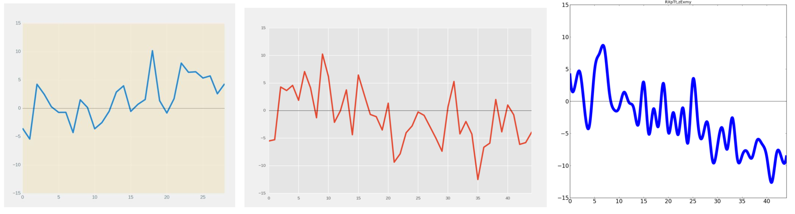
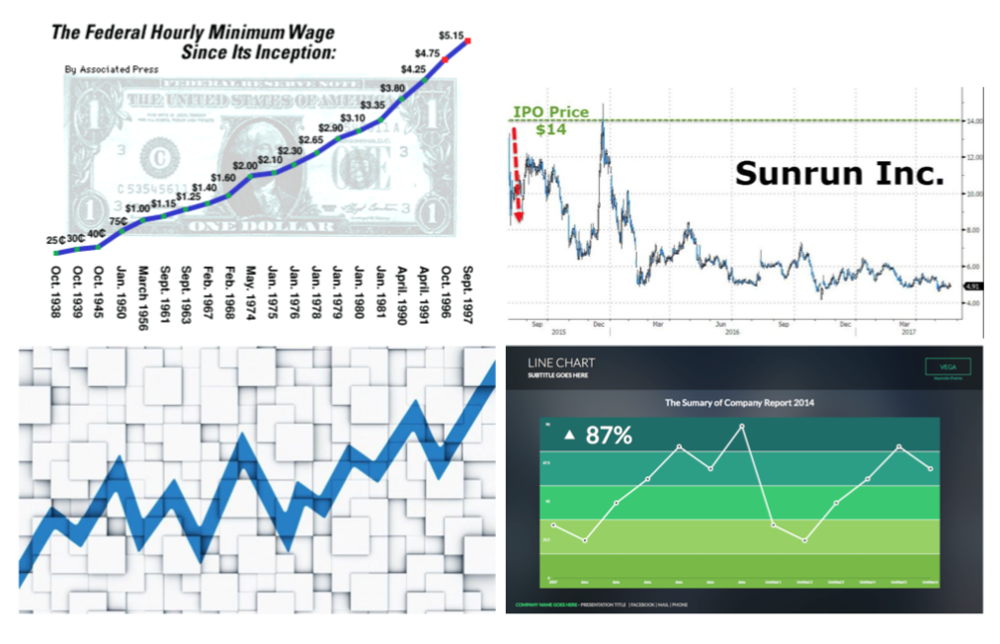

# Towards Graph Trend Understanding

## Dataset

Input types:
* Single line graphs
* Scatter Plots

Outputs (Labels)
* Increase
* Decrease
* Neutral

To obtain actual data, please post an issue on this repo and we'll send it your way!

## Contributions

1. Curate a dataset containing 125,000 graphs of varying styles, functions, and trends using MatPlotlib.

   * Graph functions include linear, logarithmic, polynomial, power, exponential. 
   * Trends include stable, ascending, descending, and variable.

2. Create a multi-class classifier to infer the type of trend within a line graph. Two techniques done: machine learning using a ResNet-34 in PyTorch, and traditional methods for visual feature extractions.

#### Further Steps

* Process graphs with multiple time-series data (multiple lines).

* Infer trend from a scatterplot.

* Infer maxima and minima in a graph.

* Include OCR to parse through title and axis labels and generate an actual coherent title.

### Examples of graphs
The following graphs are labeled 'increasing', 'neutral', and 'decreasing', respectively. These were generated by the code found within this repo.

Test set contains images images scraped from the Internet by Googling. They come with a lot more variation and noise. These were manually labeled by us to maintain consistency.

## References
1. J. Am, P. Kaur, M. Owonibi, and B. Bouaziz. Convolutional neural network based chart image classification.
2. M. A. Borkin, Z. Bylinskii, N. W. Kim, C. M. Bainbridge, C. S. Yeh, D. Borkin, H. Pfister, and A. Oliva. Be- yond memorability: Visualization recognition and recall. IEEE Transactions on Visualization and Computer Graph- ics, 22(1):519–528, Jan 2016.
3. J.Canny.Acomputationalapproachtoedgedetection.IEEE Trans. Pattern Analysis and Machine Intelligence, pages 679–698, 1986.
4. K. He, X. Zhang, S. Ren, and J. Sun. Deep residual learning for image recognition. CoRR, abs/1512.03385, 2015.
5. J. D. Hunter. Matplotlib: A 2d graphics environment. Com- puting In Science & Engineering, 9(3):90–95, 2007.
6. Q. M. LLC. The atlas. 2017.
7. J. Poco and J. Heer. Reverse-engineering visualizations: Re-
covering visual encodings from chart images. Computer
Graphics Forum (Proc. EuroVis), 2017.
8. A.Satyanarayan,R.Russell,J.Hoffswell,andJ.Heer.Reac-
tive vega: A streaming dataflow architecture for declarative interactive visualization. IEEE Transactions on Visualization and Computer Graphics, 22(1):659–668, Jan 2016.
9. M. Savva, N. Kong, A. Chhajta, L. Fei-Fei, M. Agrawala, and J. Heer. Revision: Automated classification, analysis and redesign of chart images. In ACM User Interface Software & Technology (UIST), 2011.
10. R. Smith. An overview of the tesseract ocr engine. In Pro- ceedings of the Ninth International Conference on Document Analysis and Recognition - Volume 02, ICDAR ’07, pages 629–633, Washington, DC, USA, 2007. IEEE Computer So- ciety.
11. R. Stephens. Probabilistic approach to the hough transform. Image and Vision Computing, pages 66–71, Feb 1991.
